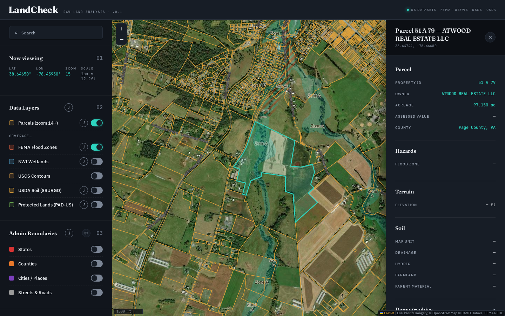

# LandCheck — Raw Land Analysis

**A single map with every public dataset that matters for raw land.**

LandCheck is a free, open-source web tool for evaluating raw land before purchase. Click any point on a US map and instantly pull elevation, FEMA flood zone, USDA soil, wetlands, and protected-lands data — plus county parcel boundaries with owner, acreage, and assessed value where the county publishes them. Draw a polygon to measure acreage and slope. No account, no signup, no paywall, no tracking — just public US government data, surfaced fast.

> Built for landowners, by a landowner. It makes the hour-long "check a piece of raw land" workflow take under a minute — without bouncing between five county portals.



## What it does

- **Click-to-inspect** — elevation (USGS EPQS), flood zone (FEMA NFHL), soil map unit (USDA SSURGO), census-tract demographics, reverse-geocoded address — all from a single map click
- **Parcel boundaries** — owner, acreage, and assessed value where the county exposes them, with a link to the county's own property page
- **Toggleable overlays** — FEMA flood zones, NWI wetlands, USGS contours, SSURGO soil polygons with a quality stoplight, PAD-US protected lands, state/county/city boundaries
- **Measure** — draw polygons (acreage + perimeter + terrain change across vertices) or polylines (distance)
- **Save and compare** — pin up to three places side-by-side, persisted locally in your browser
- **PDF export** — one-click report bundling every readout plus a rendered map image
- **Multiple basemaps** — Esri satellite, USGS topo, OpenStreetMap, Esri terrain

## Coverage — honest version

- **Federal layers (flood, soil, wetlands, contours, elevation, protected lands): the entire US.**
- **Parcel boundaries** — from official state & county GIS portals, covering **all 50 states**, in these tiers:
  - **33 states wired statewide** — every state with a free, official, no-token statewide parcel service: AK, AR, CO, CT, DE, FL, HI, ID, IN, MA, MD, ME, MN, MS, MT, NC, ND, NE, NH, NJ, NV, NY, OH, PA, RI, TN, TX, UT, VT, WA, WI, WV, WY. (NY, TN, MN, PA cover most-but-not-all counties — NY excludes NYC; MN is opt-in; PA's statewide layer omits 7 counties, 5 of which are gap-filled below.)
  - **16 more states via their largest metro counties** (where no statewide service exists) — CA (LA, San Diego, Orange), IL (Cook, DuPage, Lake), GA (Fulton, Gwinnett, Cobb), MI (Oakland, Kent), AZ (Maricopa, Pima, Pinal), MO (St. Louis, Jackson, St. Charles), OR (Multnomah, Washington, Lane), KY (Jefferson, Fayette, Kenton), SC (Greenville, Richland, Charleston), OK (Oklahoma, Tulsa, Cleveland), AL (Jefferson, Mobile, Madison), LA (East Baton Rouge), IA (Linn, Scott), KS (Sedgwick, Shawnee), SD (Pennington), NM (Bernalillo, Doña Ana).
  - **5 Pennsylvania counties** wired individually to fill the gaps where the PA statewide layer has no data — Delaware, York, Lackawanna, Butler, Washington. (Luzerne and Erie remain "coming soon" — no usable public countywide service.)
  - **Virginia via 30 counties and cities** wired individually.
- The in-app **Coverage** panel lists every verified locality by region and every place we investigated but couldn't wire (no public service, behind a WAF/Cloudflare, broken CORS, etc.) under "coming soon" with the specific reason. Every endpoint was live-verified + adversarially re-verified; re-run `npm run health` to re-check.
- Owner names and assessed values appear only where the source GIS exposes them — many don't (some states/counties redact owner names by law). Acreage shows where a usable area field exists, otherwise "not reported".

## Data sources

All free and public, queried live from the agencies that publish them:

| Layer / Lookup | Source |
| --- | --- |
| Elevation | [USGS Elevation Point Query Service](https://epqs.nationalmap.gov/) |
| Flood zones | [FEMA National Flood Hazard Layer](https://hazards.fema.gov/femaportal/wps/portal/NFHLWMS) |
| Wetlands | [USFWS National Wetlands Inventory](https://www.fws.gov/program/national-wetlands-inventory) |
| Contours | [USGS 3DEP Contours](https://www.usgs.gov/3d-elevation-program) |
| Soil | [USDA NRCS SSURGO](https://www.nrcs.usda.gov/resources/data-and-reports/soil-survey-geographic-database-ssurgo) (tiles via [UC Davis SoilWeb](https://casoilresource.lawr.ucdavis.edu/soilweb/)) |
| Soil detail | [USDA Soil Data Access](https://sdmdataaccess.sc.egov.usda.gov/) |
| Protected lands | [USGS PAD-US](https://www.usgs.gov/programs/gap-analysis-project/science/pad-us-data-overview) |
| Parcels | Official state &amp; county GIS portals (33 statewide + 40 metro counties + 5 PA gap-fill counties + 30 VA localities — see in-app Coverage) |
| Demographics | [US Census ACS 5-year](https://www.census.gov/programs-surveys/acs) via TIGERweb tract lookup |
| Admin boundaries | Esri Living Atlas, US Census TIGERweb |
| Geocoding | US Census Geocoder, [OpenStreetMap Nominatim](https://nominatim.openstreetmap.org/) |
| Topo / satellite tiles | USGS National Map, Esri ArcGIS Online, CARTO |

## FAQ

**Is it really free?** Yes. Every dataset is a public US government API. There's no account, no email gate, no premium tier. If it saved you a trip to the assessor's office, [buy me a coffee](https://buymeacoffee.com/biobash).

**Can I trust the data for a purchase decision?** Treat it as a research aid, not due diligence. Boundaries are county GIS renderings, not surveys; flood zones change; soil maps are 1:24,000-scale. **Verify with a licensed surveyor and a title company before any purchase decision.**

**Why doesn't my county show parcels?** Either the county doesn't publish a public GIS endpoint, or we haven't wired it yet. The in-app Coverage panel shows what we found for each locality. Request a county by [opening a GitHub issue](https://github.com/nfruits/landcheck/issues) or emailing [nfruits@tutanota.com](mailto:nfruits@tutanota.com).

**Where's my data stored?** Your saved places, view position, and layer preferences live in your browser's localStorage only. There's no backend of ours — this is a static page with no analytics. Your map clicks and searches are sent directly to the public data providers (OpenStreetMap, US Census, USGS, FEMA, USDA, and county GIS servers) to fetch results, and those services may log the request.

**Is this a brokerage / MLS / lead-gen site?** No. It's a side project. It doesn't list properties, collect leads, or upsell anything.

## Run locally

Requires Python 3 (for the dev server) and Node.js 18+ (only for tests).

```bash
git clone https://github.com/nfruits/landcheck.git
cd landcheck
npm run serve            # http://127.0.0.1:8765
```

That's it — no build step. The app is plain HTML + ES modules, with Leaflet vendored under `vendor/`. The landing page is `index.html`; the map tool is `app.html`.

### Run the test suite

```bash
npm install              # one-time, installs Playwright
npx playwright install chromium
npm test                 # full e2e suite (Playwright spawns its own server on :8766)
```

Single spec: `npx playwright test tests/e2e/lookups.spec.js`
By name: `npx playwright test -g "elevation"`

### Endpoint health audit

County GIS endpoints drift. `npm run health -- --origin https://landcheck.info` live-checks every endpoint (HTTPS, reachability, CORS against the production origin) and prints a pass/fail table — run it monthly.

## License

MIT — see [LICENSE](LICENSE).

---

If this saved you a trip to the assessor's office, you can [buy me a coffee](https://buymeacoffee.com/biobash).
